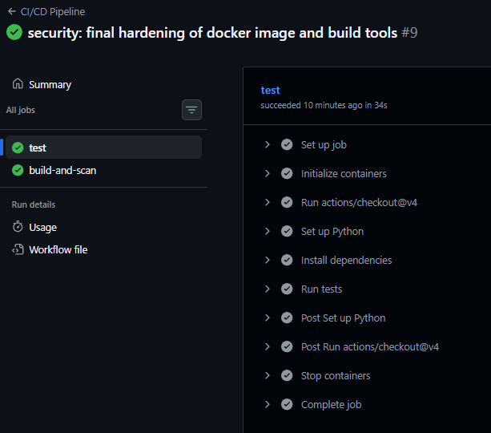
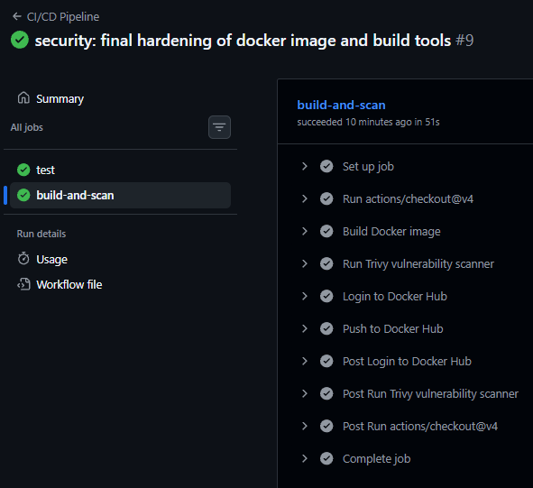
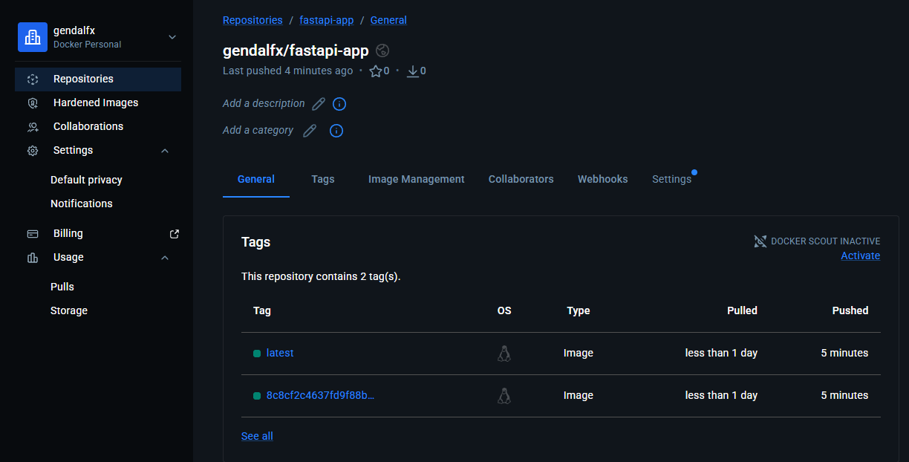

# Software-Testing-Basics-KB231 made by Dukhvin Andrii

## FastAPI Cloud-Native App with DevSecOps Pipeline 🚀🛡️

Цей проєкт демонструє підхід до тестування застосунків на FastAPI з впровадженням автоматизованого CI/CD пайплайну, орієнтованого на безпеку.

## 🌟 Основні можливості
* **FastAPI + SQLAlchemy**: Сучасний backend з асинхронною роботою та автоматичною ініціалізацією БД.
* **PostgreSQL**: Надійна реляційна база даних для зберігання вітань (Greetings).
* **Docker & Docker Compose**: Повна контейнеризація для ідентичності середовищ розробки та продакшну.
* **GitHub Actions CI/CD**: Повний цикл автоматизації — від тестування до публікації в Docker Hub.

---

## 🛡️ DevSecOps та Безпека 

У проєкті реалізовано концепцію **Shift-Left Security** — перевірка безпеки інтегрована на найраніших етапах розробки.

### 1. Сканування на вразливості (Trivy)
Пайплайн включає етап сканування Docker-образу за допомогою **Trivy**. Якщо в системних бібліотеках або залежностях Python знайдено вразливості рівнів `HIGH` або `CRITICAL`, процес збірки автоматично зупиняється.
> [!IMPORTANT]
> Для зменшення "поверхні атаки" використовуються мінімалістичний **slim-образ** на базі Debian.

### 2. Управління секретами
Усі конфіденційні дані (паролі БД, токени Docker Hub) надійно зберігаються у **GitHub Secrets** і не потрапляють у відкритий доступ (репозиторій).

---

## ⚙️ Автоматизація (CI/CD Pipeline)

Мій пайплайн складається з трьох ключових етапів:

1.  **Testing (Pytest)**:
    * Автоматичне розгортання тимчасового контейнера PostgreSQL для тестів.
    * Проведення інтеграційних тестів API за допомогою `HTTPIX` та `ASGITransport`.
2.  **Security Scan (Trivy)**:
    * Збірка образу та повна перевірка на CVE (Common Vulnerabilities and Exposures).
    * Контроль цілісності базового образу.
3.  **Build & Push**:
    * Після успішних перевірок образ отримує два теги: унікальний `SHA` коміту (для аудиту та відкатів) та `latest` (для швидкого деплою).

---

## 📸 Скриншоти роботи

### 🛡️ Успішне сканування безпеки (Trivy)
┌──────────────────────────────────────────────────────────────────────────────────┬────────────┬─────────────────┬─────────┐
│                                      Target                                      │    Type    │ Vulnerabilities │ Secrets │
├──────────────────────────────────────────────────────────────────────────────────┼────────────┼─────────────────┼─────────┤
│ ***/fastapi-app:8c8cf2c4637fd9f88bc02aab1e9e5ba649c39e9c (debian 13.3)      │   debian   │        0        │    -    │
├──────────────────────────────────────────────────────────────────────────────────┼────────────┼─────────────────┼─────────┤
│ usr/local/lib/python3.11/site-packages/SQLAlchemy-2.0.11.dist-info/METADATA      │ python-pkg │        0        │    -    │
├──────────────────────────────────────────────────────────────────────────────────┼────────────┼─────────────────┼─────────┤
│ usr/local/lib/python3.11/site-packages/annotated_doc-0.0.4.dist-info/METADATA    │ python-pkg │        0        │    -    │
├──────────────────────────────────────────────────────────────────────────────────┼────────────┼─────────────────┼─────────┤
│ usr/local/lib/python3.11/site-packages/anyio-4.12.1.dist-info/METADATA           │ python-pkg │        0        │    -    │
├──────────────────────────────────────────────────────────────────────────────────┼────────────┼─────────────────┼─────────┤
│ usr/local/lib/python3.11/site-packages/click-8.3.1.dist-info/METADATA            │ python-pkg │        0        │    -    │
├──────────────────────────────────────────────────────────────────────────────────┼────────────┼─────────────────┼─────────┤
│ usr/local/lib/python3.11/site-packages/fastapi-0.125.0.dist-info/METADATA        │ python-pkg │        0        │    -    │
├──────────────────────────────────────────────────────────────────────────────────┼────────────┼─────────────────┼─────────┤
│ usr/local/lib/python3.11/site-packages/greenlet-3.3.2.dist-info/METADATA         │ python-pkg │        0        │    -    │
├──────────────────────────────────────────────────────────────────────────────────┼────────────┼─────────────────┼─────────┤
│ usr/local/lib/python3.11/site-packages/h11-0.16.0.dist-info/METADATA             │ python-pkg │        0        │    -    │
├──────────────────────────────────────────────────────────────────────────────────┼────────────┼─────────────────┼─────────┤
│ usr/local/lib/python3.11/site-packages/idna-3.11.dist-info/METADATA              │ python-pkg │        0        │    -    │
├──────────────────────────────────────────────────────────────────────────────────┼────────────┼─────────────────┼─────────┤
│ usr/local/lib/python3.11/site-packages/packaging-26.0.dist-info/METADATA         │ python-pkg │        0        │    -    │
├──────────────────────────────────────────────────────────────────────────────────┼────────────┼─────────────────┼─────────┤
│ usr/local/lib/python3.11/site-packages/pip-26.0.1.dist-info/METADATA             │ python-pkg │        0        │    -    │
├──────────────────────────────────────────────────────────────────────────────────┼────────────┼─────────────────┼─────────┤
│ usr/local/lib/python3.11/site-packages/psycopg2_binary-2.9.6.dist-info/METADATA  │ python-pkg │        0        │    -    │
├──────────────────────────────────────────────────────────────────────────────────┼────────────┼─────────────────┼─────────┤
│ usr/local/lib/python3.11/site-packages/pydantic-1.10.7.dist-info/METADATA        │ python-pkg │        0        │    -    │
├──────────────────────────────────────────────────────────────────────────────────┼────────────┼─────────────────┼─────────┤
│ usr/local/lib/python3.11/site-packages/python_dotenv-1.0.0.dist-info/METADATA    │ python-pkg │        0        │    -    │
├──────────────────────────────────────────────────────────────────────────────────┼────────────┼─────────────────┼─────────┤
│ usr/local/lib/python3.11/site-packages/setuptools-82.0.0.dist-info/METADATA      │ python-pkg │        0        │    -    │
├──────────────────────────────────────────────────────────────────────────────────┼────────────┼─────────────────┼─────────┤
│ usr/local/lib/python3.11/site-packages/setuptools/_vendor/autocommand-2.2.2.dis- │ python-pkg │        0        │    -    │
│ t-info/METADATA                                                                  │            │                 │         │
├──────────────────────────────────────────────────────────────────────────────────┼────────────┼─────────────────┼─────────┤
│ usr/local/lib/python3.11/site-packages/setuptools/_vendor/backports.tarfile-1.2- │ python-pkg │        0        │    -    │
│ .0.dist-info/METADATA                                                            │            │                 │         │
├──────────────────────────────────────────────────────────────────────────────────┼────────────┼─────────────────┼─────────┤
│ usr/local/lib/python3.11/site-packages/setuptools/_vendor/importlib_metadata-8.- │ python-pkg │        0        │    -    │
│ 7.1.dist-info/METADATA                                                           │            │                 │         │
├──────────────────────────────────────────────────────────────────────────────────┼────────────┼─────────────────┼─────────┤
│ usr/local/lib/python3.11/site-packages/setuptools/_vendor/jaraco.text-4.0.0.dis- │ python-pkg │        0        │    -    │
│ t-info/METADATA                                                                  │            │                 │         │
├──────────────────────────────────────────────────────────────────────────────────┼────────────┼─────────────────┼─────────┤
│ usr/local/lib/python3.11/site-packages/setuptools/_vendor/jaraco_context-6.1.0.- │ python-pkg │        0        │    -    │
│ dist-info/METADATA                                                               │            │                 │         │
├──────────────────────────────────────────────────────────────────────────────────┼────────────┼─────────────────┼─────────┤
│ usr/local/lib/python3.11/site-packages/setuptools/_vendor/jaraco_functools-4.4.- │ python-pkg │        0        │    -    │
│ 0.dist-info/METADATA                                                             │            │                 │         │
├──────────────────────────────────────────────────────────────────────────────────┼────────────┼─────────────────┼─────────┤
│ usr/local/lib/python3.11/site-packages/setuptools/_vendor/more_itertools-10.8.0- │ python-pkg │        0        │    -    │
│ .dist-info/METADATA                                                              │            │                 │         │
├──────────────────────────────────────────────────────────────────────────────────┼────────────┼─────────────────┼─────────┤
│ usr/local/lib/python3.11/site-packages/setuptools/_vendor/packaging-26.0.dist-i- │ python-pkg │        0        │    -    │
│ nfo/METADATA                                                                     │            │                 │         │
├──────────────────────────────────────────────────────────────────────────────────┼────────────┼─────────────────┼─────────┤
│ usr/local/lib/python3.11/site-packages/setuptools/_vendor/platformdirs-4.4.0.di- │ python-pkg │        0        │    -    │
│ st-info/METADATA                                                                 │            │                 │         │
├──────────────────────────────────────────────────────────────────────────────────┼────────────┼─────────────────┼─────────┤
│ usr/local/lib/python3.11/site-packages/setuptools/_vendor/tomli-2.4.0.dist-info- │ python-pkg │        0        │    -    │
│ /METADATA                                                                        │            │                 │         │
├──────────────────────────────────────────────────────────────────────────────────┼────────────┼─────────────────┼─────────┤
│ usr/local/lib/python3.11/site-packages/setuptools/_vendor/wheel-0.46.3.dist-inf- │ python-pkg │        0        │    -    │
│ o/METADATA                                                                       │            │                 │         │
├──────────────────────────────────────────────────────────────────────────────────┼────────────┼─────────────────┼─────────┤
│ usr/local/lib/python3.11/site-packages/setuptools/_vendor/zipp-3.23.0.dist-info- │ python-pkg │        0        │    -    │
│ /METADATA                                                                        │            │                 │         │
├──────────────────────────────────────────────────────────────────────────────────┼────────────┼─────────────────┼─────────┤
│ usr/local/lib/python3.11/site-packages/starlette-0.50.0.dist-info/METADATA       │ python-pkg │        0        │    -    │
├──────────────────────────────────────────────────────────────────────────────────┼────────────┼─────────────────┼─────────┤
│ usr/local/lib/python3.11/site-packages/typing_extensions-4.15.0.dist-info/METAD- │ python-pkg │        0        │    -    │
│ ATA                                                                              │            │                 │         │
├──────────────────────────────────────────────────────────────────────────────────┼────────────┼─────────────────┼─────────┤
│ usr/local/lib/python3.11/site-packages/uvicorn-0.41.0.dist-info/METADATA         │ python-pkg │        0        │    -    │
├──────────────────────────────────────────────────────────────────────────────────┼────────────┼─────────────────┼─────────┤
│ usr/local/lib/python3.11/site-packages/wheel-0.46.3.dist-info/METADATA           │ python-pkg │        0        │    -    │
└──────────────────────────────────────────────────────────────────────────────────┴────────────┴─────────────────┴─────────┘
Legend:
- '-': Not scanned
- '0': Clean (no security findings detected)

### ✅ Проходження тестів у GitHub Actions

### 🐳 Репозиторій у Docker Hub

